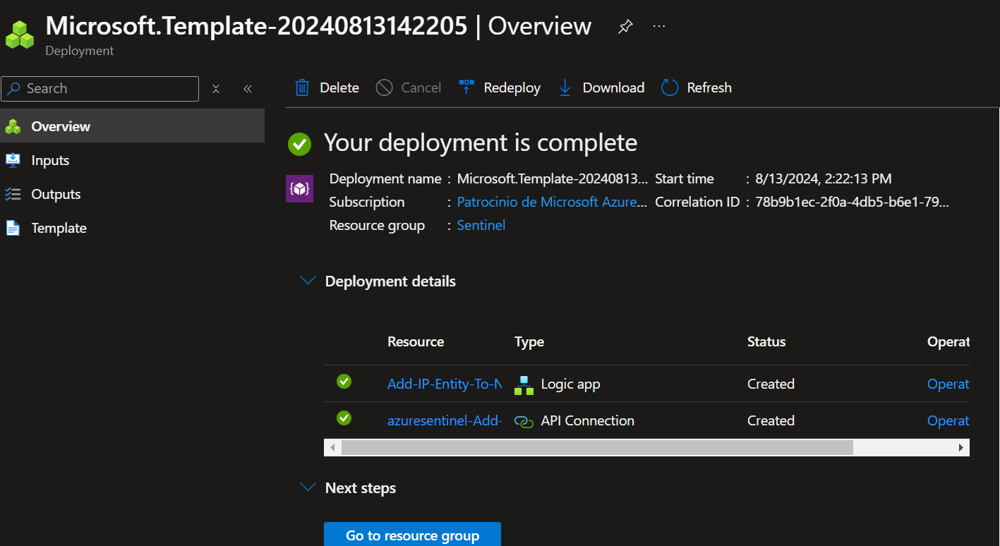
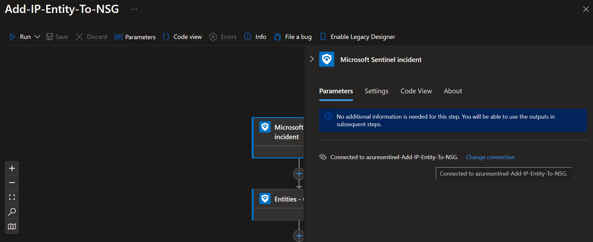

# Add-IP-Entity-To-NSG

Este playbook se ejecutará utilizando un disparador basado en incidentes y agregará las entidades IP a una regla de grupo de seguridad de red.

Si no existe una regla de grupo de seguridad de red con la prioridad de regla configurada, se creará una regla para bloquear todo el tráfico entrante desde las entidades IP en el incidente de Microsoft Sentinel a todos los destinos.

Si ya existe una regla de grupo de seguridad de red, las direcciones IP de origen de la regla se agregarán con las entidades IP del incidente de Microsoft Sentinel.

## Despliegue

 

## Requisitos 
- Se debe crear un grupo de seguridad de red y adjuntarlo a las interfaces o subredes de red relevantes.
- Se puede crear previamente una regla en el NSG con las configuraciones deseadas; de lo contrario, el libro de estrategias creará automáticamente una regla de denegación de entrada.

## Despligue
 

1. Revise que los datos son correctos, principalmente en Network Security Group Resource Id, donde debe colocar el *'tenant id'*, *'resourceGroupName'* y *'NSG Group*

[] 

2. Luego de agregar los datos faltantes, de click en *'Review + create'* y por último en *'Create'*

3. En los resultados del despligue, le saldrán los siguientes recursos:
[] 

4. Haga click en la Logic app creada
[] 

5. Revise la configuración de las conexiones 
[] 

## Después del despliegue

- Otorgue a la identidad administrada de Logic App acceso al rol RBAC de *Network Contributor* de red en el NSG que modificará
- Escoja la identidad administrada asignada a la Logic App y cree el rol dando click en "Create" 

- Otorgue a la aplicación lógica la identidad administrada *Microsoft Sentinel Responder*  en el grupo de recursos con  Microsoft Sentinel, esto permite que la aplicación lógica informe mensajes de estado al incidente y siga los pasos anteriores.
[] 
  
