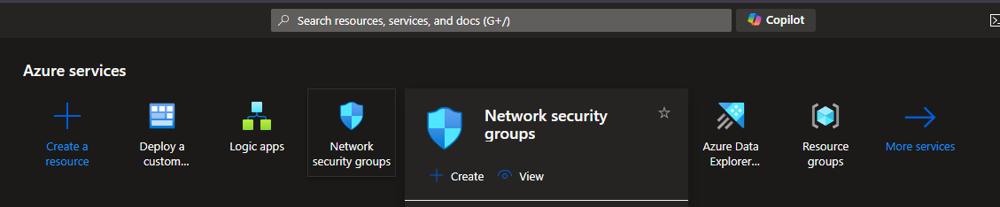
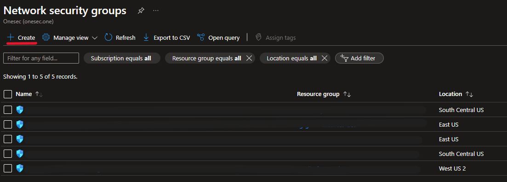

# Add-IP-Entity-To-NSG

Este playbook se ejecutará utilizando un disparador basado en incidentes y agregará las entidades IP a una regla de grupo de seguridad de red.

Si no existe una regla de grupo de seguridad de red con la prioridad de regla configurada, se creará una regla para bloquear todo el tráfico entrante desde las entidades IP en el incidente de Microsoft Sentinel a todos los destinos.

Si ya existe una regla de grupo de seguridad de red, las direcciones IP de origen de la regla se agregarán con las entidades IP del incidente de Microsoft Sentinel.

## Despliegue

 

## Requisitos 
- Se debe crear un grupo de seguridad de red y adjuntarlo a las interfaces o subredes de red relevantes.
- Se puede crear previamente una regla en el NSG con las configuraciones deseadas; de lo contrario, el libro de estrategias creará automáticamente una regla de denegación de entrada.

## Crear un Grupo de Seguridad de Red (NSG)
1. Accede al Portal de Azure y busca NSGs:

[] 

2. En el panel izquierdo, selecciona "Grupo de seguridad de red". Si no lo ves, usa la barra de búsqueda en la parte superior.

3. Crear un nuevo NSG:

Haz clic en "Crear" para iniciar el proceso de creación de un nuevo NSG.

[] 

4. Configura el NSG:

Suscripción: Selecciona la suscripción en la que quieres crear el NSG.
Grupo de recursos: Selecciona un grupo de recursos existente o crea uno nuevo.
Nombre: Ingresa un nombre para el NSG.
Región: Selecciona la región en la que deseas crear el NSG.

[] 

5. Revisar y crear:

Revisa la configuración y haz clic en "Crear" para completar la creación del NSG.
[] 

### Crear reglas en el NSG
1. Selecciona el NSG creado:
[] 

2. En la lista de NSGs, selecciona el NSG que acabas de crear.
Agregar reglas de seguridad:
En el panel del NSG, selecciona "Reglas de entrada" 
Haz clic en "Agregar" para crear una nueva regla.

[] 

3. Configura la regla:

- Nombre: Asigna un nombre a la regla.
- Prioridad: Establece una prioridad para la regla (un número más bajo tiene mayor prioridad).
- Fuente: Define la fuente (puede ser IP, rango de IP, o cualquier otro).
- Puerto de destino: Especifica el puerto o rango de puertos que la regla debe afectar.
- Acción: Selecciona si la regla debe permitir o denegar el tráfico.
- Protocolo: Define el protocolo (TCP, UDP, etc.).
- Descripción: Opcionalmente, agrega una descripción para identificar la regla más fácilmente.

[] 

4. Crear la regla:

Haz clic en "Agregar" para guardar la regla.

### Adjuntar el NSG a Interfaces de Red o Subredes

1. Adjuntar a una interfaz de red:

- Ve a "Network Interfaces" en el portal de Azure.
- Selecciona la interfaz de red a la que deseas adjuntar el NSG.
- En el panel de la interfaz de red, selecciona "Grupo de seguridad de red".
- En el menú desplegable, selecciona el NSG que creaste y haz clic en "Guardar".

[] 

2. Adjuntar a una subred:

- Ve a "Virtual networks" en el portal de Azure.
- Selecciona la red virtual que contiene la subred a la que deseas adjuntar el NSG.
- En el panel de la red virtual, selecciona "Subredes".
- Selecciona la subred en la que deseas adjuntar el NSG.
- En el menú de la subred, selecciona el NSG que creaste y haz clic en "Guardar".

[] 

## Despligue
 

1. Revise que los datos son correctos, principalmente en Network Security Group Resource Id, donde debe colocar el *'tenant id'*, *'resourceGroupName'* y *'NSG Group*

[] 

2. Luego de agregar los datos faltantes, de click en *'Review + create'* y por último en *'Create'*

3. En los resultados del despligue, le saldrán los siguientes recursos:
[] 

4. Haga click en la Logic app creada
[] 

5. Revise la configuración de las conexiones 
[] 

## Después del despliegue

- Otorgue a la identidad administrada de Logic App acceso al rol RBAC de *Network Contributor* de red en el NSG que modificará

[] 

- Escoja la identidad administrada asignada a la Logic App y cree el rol dando click en "Create"

[] 

- Otorgue a la aplicación lógica la identidad administrada *Microsoft Sentinel Responder*  en el grupo de recursos con  Microsoft Sentinel, esto permite que la aplicación lógica informe mensajes de estado al incidente y siga los pasos anteriores.
[] 
  
